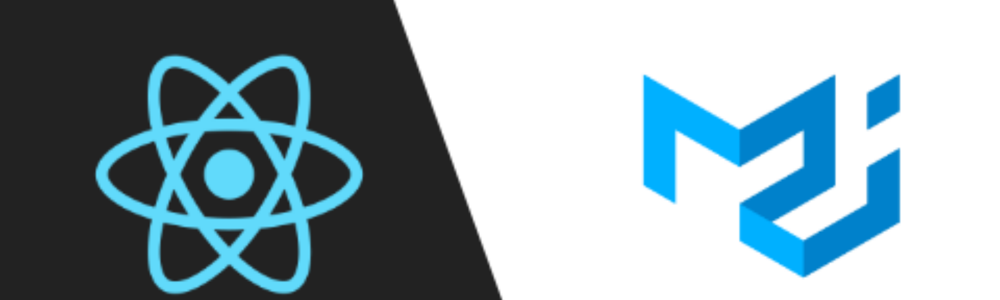

## React Portfolio (Particles) Website⚡



## Fun Fact :

This website was built with Material UI.

<br />


This project was bootstrapped with [Create React App](https://github.com/facebook/create-react-app).

## Dependencies:

- #### [React Router](https://www.npmjs.com/package/react-router)
- #### [React Typed](https://www.npmjs.com/package/react-typed)
- #### [Material UI Core](https://material-ui.com/)
- #### [Material UI Styles](https://material-ui.com/styles/basics/)
- #### [Material UI Icons](https://material-ui.com/components/material-icons/)

## Steps to run the website in local server :

<br />

1. Fork or Clone or Download the Repository

2. Open the Code Editor inside the Project Folder

3. Run the given code below in the terminal ( without the **$** symbol )

<br />

```javascript

$ npm install

$ npm start

```

This will start the Website in the local host **5000**